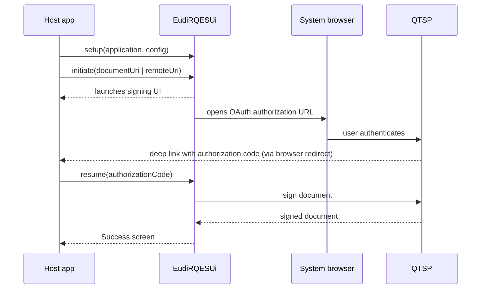

# EUDI Remote Qualified Electronic Signature (RQES) UI library for Android

[](https://opensource.org/licenses/Apache-2.0)
[](https://central.sonatype.com/artifact/eu.europa.ec.eudi/eudi-lib-android-rqes-ui)

:heavy_exclamation_mark: **Important!** Before you proceed, please read
the [EUDI Wallet Reference Implementation project description](https://github.com/eu-digital-identity-wallet/.github/blob/main/profile/reference-implementation.md)

----

## Table of contents

* [Overview](#overview)
  * [What the SDK shows the user](#what-the-sdk-shows-the-user)
  * [High-level flow](#high-level-flow)
* [Requirements](#requirements)
* [Installation](#installation)
* [How to use](#how-to-use)
  * [1. Configuration](#1-configuration)
  * [2. Setup](#2-setup)
  * [3. Deep link registration](#3-deep-link-registration)
  * [4. Host Activity setup](#4-host-activity-setup)
  * [5. Initialization](#5-initialization)
* [Theming and rebranding](#theming-and-rebranding)
  * [Colors and typography](#colors-and-typography)
  * [Header logo](#header-logo)
  * [Text and labels](#text-and-labels)
* [Error handling](#error-handling)
* [Sample app](#sample-app)
* [How to contribute](#how-to-contribute)
* [License](#license)

## Overview

This module provides core and UI functionality for the EUDI Wallet, focused on the
**Remote Qualified Electronic Signature (RQES)** service. RQES allows users to sign
documents using a qualified certificate held remotely by a Qualified Trust Service
Provider (QTSP).

The SDK supports two flows:

- **Local file flow** — the host app already has a local document (PDF) selected and
  asks the SDK to sign it.
- **Remote URL flow** — the host app receives a remote URL (typically via a deep link
  or QR code) which the SDK resolves to a document and then signs.

It ships ready-made Jetpack Compose screens for QTSP selection, certificate selection,
document preview, and a success/sharing screen, plus the orchestration around OAuth
authorization, credential authorization, signing, and sharing the signed document.

You configure the SDK at compile time via the `EudiRQESUiConfig` interface and drive
it at runtime through the `EudiRQESUi` object.

### What the SDK shows the user

- **Options selection screen** — pick the QTSP and signing certificate.
- **View document screen** — preview the original or signed PDF.
- **Success screen** — confirm the signed document and share it.

### High-level flow



## Requirements

- Android 10 (API level 29) or higher
- Java 17 (the SDK is compiled with `JvmTarget.JVM_17`)
- A Kotlin host app is recommended — the public API uses Kotlin `value class` types
  (`DocumentUri`, `RemoteUri`). The SDK ships its own Jetpack Compose UI, so your app
  does **not** need to use Compose itself.

## Installation

The library is published on Maven Central. Add the dependency to your app's
`build.gradle.kts`:

```kotlin
dependencies {
    implementation("eu.europa.ec.eudi:eudi-lib-android-rqes-ui:$version")
}
```

Replace `$version` with the latest released version from
[Maven Central](https://central.sonatype.com/artifact/eu.europa.ec.eudi/eudi-lib-android-rqes-ui)
or the [GitHub releases](https://github.com/eu-digital-identity-wallet/eudi-lib-android-rqes-ui/releases) page.

## How to use

### 1. Configuration

Implement `EudiRQESUiConfig` to supply runtime configuration to the SDK.

| Property                  | Required | Default                            | Purpose                                                                |
|---------------------------|----------|------------------------------------|------------------------------------------------------------------------|
| `qtsps`                   | Yes      | —                                  | List of Qualified Trust Service Providers the user can pick from.      |
| `documentRetrievalConfig` | Yes      | —                                  | Certificate-trust policy for resolving remote documents (required even for local-only flows). |
| `translations`            | No       | English defaults built into the SDK | Override or extend localized strings.                                  |
| `themeManager`            | No       | Built-in light/dark theme          | Customize colors and typography (see [Theming](#theming-and-rebranding)). |
| `printLogs`               | No       | `false`                            | Enable Timber debug logging.                                           |

Example (mirrors the [`:test-app`](test-app/) reference implementation):

```kotlin
class RQESConfigImpl(val context: Context) : EudiRQESUiConfig {

    override val qtsps: List<QtspData>
        get() = listOf(
            QtspData(
                // Human-readable name shown in the QTSP picker.
                name = "Wallet-Centric",
                // QTSP CSC v2 endpoint.
                endpoint = "https://walletcentric.signer.eudiw.dev/csc/v2".toUriOrEmpty(),
                // Optional Timestamp Authority URL.
                tsaUrl = "https://timestamp.sectigo.com/qualified",
                // OAuth2 client credentials issued by the QTSP.
                clientId = "wallet-client-tester",
                clientSecret = "somesecrettester2",
                // Deep link the QTSP redirects to after authorization.
                // Must match the host-app intent filter (see section 3).
                authFlowRedirectionURI = URI.create("rqes://oauth/callback"),
                hashAlgorithm = HashAlgorithmOID.SHA_256,
            )
        )

    override val documentRetrievalConfig: DocumentRetrievalConfig
        get() = DocumentRetrievalConfig.X509Certificates(
            context = context,
            certificates = listOf(R.raw.my_certificate),
            shouldLog = BuildConfig.DEBUG,
        )

    // Optional — overrides for individual localized strings.
    override val translations: Map<String, Map<LocalizableKey, String>>
        get() = mapOf(
            "en" to mapOf(LocalizableKey.View to "VIEW")
        )

    override val printLogs: Boolean
        get() = BuildConfig.DEBUG
}
```

You can supply multiple `QtspData` entries; the user selects one in the options screen.

`documentRetrievalConfig` is required even if you only use the local-file flow, although
it only takes effect when resolving *remote* documents. Besides
`DocumentRetrievalConfig.X509Certificates` (shown above — trusts certificates bundled as
raw resources), you can pass `DocumentRetrievalConfig.X509CertificateImpl` with your own
`X509CertificateTrust`, or `DocumentRetrievalConfig.NoValidation` to skip certificate
validation (useful for local-only integrations or testing).

### 2. Setup

Call `setup()` once, typically from your `Application.onCreate()`. This wires the
SDK's Koin modules and applies your config.

```kotlin
class MyApplication : Application() {
    override fun onCreate() {
        super.onCreate()
        EudiRQESUi.setup(
            application = this,
            config = RQESConfigImpl(this),
            // Optional: if your host app already uses Koin, pass it here so the
            // SDK adds its modules to your application instead of starting its own.
            koinApplication = null,
        )
    }
}
```

### 3. Deep link registration

The SDK relies on the system browser for OAuth and (optionally) a deep link for
same-device document retrieval. Register the corresponding intent filters on the
Activity that should receive them.

#### OAuth callback

This must match the `authFlowRedirectionURI` set in `QtspData`. For
`URI.create("rqes://oauth/callback")`:

```xml
<intent-filter>
    <action android:name="android.intent.action.VIEW" />

    <category android:name="android.intent.category.DEFAULT" />
    <category android:name="android.intent.category.BROWSABLE" />

    <!-- scheme is the literal scheme without "://" -->
    <data
        android:scheme="rqes"
        android:host="oauth"
        android:path="/callback" />
</intent-filter>
```

Alternatively, you can use [Android App Links](https://developer.android.com/studio/write/app-link-indexing).

#### Document retrieval (same-device flow)

Only needed if you support the remote-URL flow. The host app receives the remote
URL via this deep link and passes it to `EudiRQESUi.initiate(remoteUri = ...)`.

```xml
<intent-filter>
    <action android:name="android.intent.action.VIEW" />

    <category android:name="android.intent.category.DEFAULT" />
    <category android:name="android.intent.category.BROWSABLE" />

    <data
        android:scheme="your_scheme"
        android:host="your_host" />
</intent-filter>
```

### 4. Host Activity setup

The Activity that hosts the deep-link filters needs two things, otherwise the
return from OAuth will not work:

- **`android:launchMode="singleTask"`** in the manifest so the existing instance
  receives the deep link instead of launching a new one.
- An **`onNewIntent` override** that extracts the `code` query parameter from the
  OAuth callback and forwards it to `EudiRQESUi.resume(...)`.

```kotlin
class HostActivity : ComponentActivity() {

    override fun onCreate(savedInstanceState: Bundle?) {
        super.onCreate(savedInstanceState)
        checkIntent(intent)
        // ... your normal setContent { } here
    }

    override fun onNewIntent(intent: Intent) {
        super.onNewIntent(intent)
        checkIntent(intent)
    }

    private fun checkIntent(intent: Intent) {
        val code = intent.data?.getQueryParameter("code")
        if (code != null) {
            EudiRQESUi.resume(
                context = this,
                authorizationCode = code,
            )
        }
    }
}
```

### 5. Initialization

#### Local file

Start the signing process with the URI of a local PDF (for example, one returned
by `ActivityResultContracts.OpenDocument`).

```kotlin
EudiRQESUi.initiate(
    context = activity,
    documentUri = DocumentUri(fileUri),
)
```

#### Remote URL for document retrieval

Start the signing process with a remote URL (for example, extracted from a QR
code or the document-retrieval deep link above).

```kotlin
EudiRQESUi.initiate(
    context = activity,
    remoteUri = RemoteUri(remoteUri),
)
```

In both cases, the SDK opens its own Activity (`EudiRQESContainer`) and drives the
flow until either the success screen completes or the user cancels.

## Theming and rebranding

The SDK renders its screens with **its own Material 3 Compose theme** — your host
app's theme is not applied to them. It automatically follows the system light/dark
setting and shows the matching color set (Material You dynamic color is not used).

You can rebrand the SDK along three independent axes, all wired through your
`EudiRQESUiConfig`:

| What you change      | How                                                  | Types / resources                                          |
|----------------------|------------------------------------------------------|------------------------------------------------------------|
| Colors & typography  | Override `themeManager`                              | `ThemeManager.Builder`, `ThemeColorsTemplate`, `ThemeTypographyTemplate` |
| Header logo          | Shadow the SDK drawable in your app module           | `ic_logo_icon_and_text`                                    |
| Text & labels        | Override `translations`                              | `LocalizableKey` (see [Configuration](#1-configuration))   |

> The public theming types live under `eu.europa.ec.eudi.rqesui.infrastructure.theme`
> (and its `templates` / `templates.structures` sub-packages). The SDK's built-in
> palette and typography are `internal`, so you build your own templates rather than
> tweaking the defaults.

### Colors and typography

Override the `themeManager` property and assemble a `ThemeManager` with the builder.
Colors are passed as a `ThemeColorsTemplate` (one for light, optionally one for dark);
fonts and text styles as a `ThemeTypographyTemplate`.

```kotlin
override val themeManager: ThemeManager
    get() = ThemeManager.Builder()
        .withLightColors(brandLightColors)
        .withDarkColors(brandDarkColors)   // optional — light colors are reused if omitted
        .withTypography(brandTypography)
        .build()
```

**Colors.** Every Material 3 role is required (there are no per-field defaults). Values
are ARGB `Long` literals, e.g. `0xFF2A5FD9`:

```kotlin
private val brandLightColors = ThemeColorsTemplate(
    primary = 0xFF2A5FD9,
    onPrimary = 0xFFFFFFFF,
    primaryContainer = 0xFFEADDFF,
    onPrimaryContainer = 0xFF21005D,
    secondary = 0xFFD6D9F9,
    // … provide every remaining role: the secondary/tertiary/error families,
    // background, surface and the surface*/surfaceContainer* slots, outline, scrim,
    // the inverse* roles and the *Fixed accent roles.
)
// private val brandDarkColors = ThemeColorsTemplate( … )
```

See `ThemeColorsTemplate` for the full list of roles to fill in.

**Typography.** All 15 text styles must be supplied. Each `ThemeTextStyle` field is
optional and falls back to Compose defaults when omitted. Bundle your font files under
`res/font` and reference them via `ThemeFont`:

```kotlin
private val brandFont = ThemeFont(
    res = R.font.my_brand_font,
    weight = ThemeFontWeight.W400,
    style = ThemeFontStyle.Normal,
)

private val brandTypography = ThemeTypographyTemplate(
    headlineSmall = ThemeTextStyle(
        fontFamily = listOf(brandFont),
        fontSize = 24,
        lineHeight = 32,
        letterSpacing = 0f,
        textAlign = ThemeTextAlign.Start,
    ),
    // … provide the remaining styles: display{Large,Medium,Small},
    // headline{Large,Medium}, title{Large,Medium,Small},
    // body{Large,Medium,Small} and label{Large,Medium,Small}.
)
```

> A few internal accent colors (success, warning, divider) are not part of
> `ThemeColorsTemplate` and cannot currently be themed.

### Header logo

The header/success area shows a single logo drawable, `ic_logo_icon_and_text`, which
combines the mark and the wordmark. It is not exposed through config — rebrand it by
**shadowing the resource**: declare a drawable with the same name in your app module and
it overrides the SDK's at resource-merge time.

```
your-app/src/main/res/drawable/ic_logo_icon_and_text.xml
```

Within the drawable, the wordmark paths use `?colorOnSurface`, so the text adapts to
light/dark automatically, while the mark carries its own brand colors. Optionally
override the `content_description_logo_icon_and_text` string for accessibility.

### Text and labels

All user-facing copy is overridden through `translations` (shown in
[Configuration](#1-configuration)): map any `LocalizableKey` to your own wording. For
keys that take runtime arguments, keep the `@arg` placeholder (the `ARGUMENTS_SEPARATOR`
token) where the value should be inserted — for example
`LocalizableKey.Certificate to "Cert @arg"`.

## Error handling

The SDK exposes errors via `EudiRQESUiError`, a subclass of `Exception`. Methods
that can throw it are annotated with `@Throws(EudiRQESUiError::class)`:

- `EudiRQESUi.initiate(...)` — thrown if the document URI's filename cannot be
  extracted or if the remote URI is malformed.
- `EudiRQESUi.resume(...)` — thrown if the SDK was not initiated first (no active
  signing session — i.e. `initiate(...)` was never called), or if the supplied
  `context` is not an Activity.

Failures that happen *inside* the SDK's UI (network errors during OAuth,
certificate listing, signing, etc.) are surfaced on the in-SDK error screen and
do not propagate out to the host app.

## Sample app

The [`:test-app`](test-app/) module is a complete, runnable host application that
demonstrates every integration point: a configured `EudiRQESUiConfig`, deep-link
registration, Activity wiring, and both local-file and remote-URL flows. It is
the canonical reference if anything in this README is ambiguous.

## How to contribute

We welcome contributions to this project. To ensure that the process is smooth for everyone
involved, follow the guidelines found in [CONTRIBUTING.md](CONTRIBUTING.md).

## License

Copyright (c) 2026 European Commission

Licensed under the Apache License, Version 2.0 (the "License");
you may not use this file except in compliance with the License.
You may obtain a copy of the License at

    http://www.apache.org/licenses/LICENSE-2.0

Unless required by applicable law or agreed to in writing, software
distributed under the License is distributed on an "AS IS" BASIS,
WITHOUT WARRANTIES OR CONDITIONS OF ANY KIND, either express or implied.
See the License for the specific language governing permissions and
limitations under the License.
